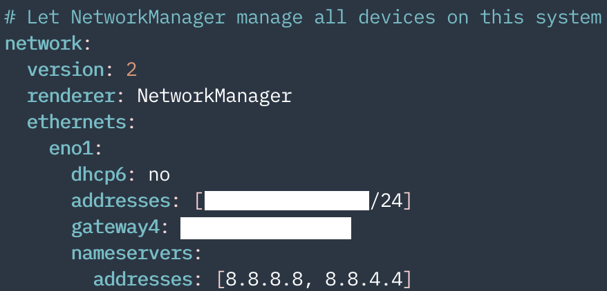

# SetupUbuntu2004
```
sudo apt-get update && sudo apt-get upgrade -y
sudo apt-get install build-essential curl git wget vim tmux -y
reboot now
```
</br>

## ZSH
1. Install Zsh and Oh-My-Zsh and Reboot.
```
sudo apt-get install zsh -y
chsh -s $(which zsh)
sh -c "$(curl -fsSL https://raw.githubusercontent.com/ohmyzsh/ohmyzsh/master/tools/install.sh)"
```
2. Install Font: <a href="https://github.com/ryanoasis/nerd-fonts">official doc</a>
3. Install Powerlevel10k theme: <a href="https://github.com/romkatv/powerlevel10k">official doc</a>
4. Set the plugins. ```plugins=(zsh-syntax-highlighting zsh-autosuggestions zsh-completions)```
```
git clone https://github.com/zsh-users/zsh-syntax-highlighting.git ${ZSH_CUSTOM:-~/.oh-my-zsh/custom}/plugins/zsh-syntax-highlighting
git clone https://github.com/zsh-users/zsh-autosuggestions ${ZSH_CUSTOM:-~/.oh-my-zsh/custom}/plugins/zsh-autosuggestions
git clone https://github.com/zsh-users/zsh-completions ${ZSH_CUSTOM:=~/.oh-my-zsh/custom}/plugins/zsh-completions
```
</br>

## GPU Setting
### Graphic driver
1. Deactivate nouveau: ```sudo vi /etc/modprobe.d/blacklist.conf```
- Add the following to the bottom.</br>
```blacklist nouveau```</br>
```options nouveau modeset=0```
- Reboot after completing ```sudo update-initramfs -u```.
2. Install nvidia-driver and Reboot.
```
ubuntu-drivers devices
sudo apt-get install nvidia-driver-xxx
```
</br>

### CUDA
1. Remove existing CUDA: ```sudo rm -rf /usr/local/cuda*```
2. Install Compatible CUDA __runfile__ at <a href="https://developer.nvidia.com/cuda-toolkit-archive">here</a>.
3. Add the following to PATH.</br>
```export PATH=$PATH:/usr/local/cuda-xx.x/bin```</br>
```export LD_LIBRARY_PATH=$LD_LIBRARY_PATH:/usr/local/cuda-xx.x/lib64```</br>
```export CUDADIR=/usr/local/cuda-xx.x```</br>
4. Check the version: ```nvcc -V```
5. Reboot</br>
</br>

### CUDNN
1. Install Compatible CUDNN: <a href="https://developer.nvidia.com/cudnn">here</a>.
2. Unzip the Tar and Rearrange the directories.
```
sudo cp include/cudnn* /usr/local/cuda/include
sudo cp lib64/libcudnn* /usr/local/cuda/lib64
sudo chmod a+r /usr/local/cuda/include/cudnn.h /usr/local/cuda/lib64/libcudnn*
```
3. Re-attach the link.
```
sudo ln -sf /usr/local/cuda-11.2/targets/x86_64-linux/lib/libcudnn_adv_train.so.x.x.x /usr/local/cuda-xx.x/targets/x86_64-linux/lib/libcudnn_adv_train.so.x
sudo ln -sf /usr/local/cuda-11.2/targets/x86_64-linux/lib/libcudnn_ops_infer.so.x.x.x  /usr/local/cuda-xx.x/targets/x86_64-linux/lib/libcudnn_ops_infer.so.x
sudo ln -sf /usr/local/cuda-11.2/targets/x86_64-linux/lib/libcudnn_cnn_train.so.x.x.x  /usr/local/cuda-xx.x/targets/x86_64-linux/lib/libcudnn_cnn_train.so.x
sudo ln -sf /usr/local/cuda-11.2/targets/x86_64-linux/lib/libcudnn_adv_infer.so.x.x.x  /usr/local/cuda-xx.x/targets/x86_64-linux/lib/libcudnn_adv_infer.so.x
sudo ln -sf /usr/local/cuda-11.2/targets/x86_64-linux/lib/libcudnn_ops_train.so.x.x.x  /usr/local/cuda-xx.x/targets/x86_64-linux/lib/libcudnn_ops_train.so.x
sudo ln -sf /usr/local/cuda-11.2/targets/x86_64-linux/lib/libcudnn_cnn_infer.so.x.x.x /usr/local/cuda-xx.x/targets/x86_64-linux/lib/libcudnn_cnn_infer.so.x
sudo ln -sf /usr/local/cuda-11.2/targets/x86_64-linux/lib/libcudnn.so.x.x.x  /usr/local/cuda-xx.x/targets/x86_64-linux/lib/libcudnn.so.x

sudo ldconfig
cd
ldconfig -N -v $(sed 's/:/ /' <<< $LD_LIBRARY_PATH) 2>/dev/null | grep libcudnn
```
4. Check the following and Reboot.</br>
libcudnn_adv_train.so.x -> libcudnn_adv_train.so.x.x.x</br>
libcudnn_adv_infer.so.x -> libcudnn_adv_infer.so.x.x.x</br>
libcudnn_ops_infer.so.x -> libcudnn_ops_infer.so.x.x.x</br>
libcudnn.so.x -> libcudnn.so.x.x.x</br>
libcudnn_ops_train.so.x -> libcudnn_ops_train.so.x.x.x</br>
libcudnn_cnn_train.so.x -> libcudnn_cnn_train.so.x.x.x</br>
libcudnn_cnn_infer.so.x -> libcudnn_cnn_infer.so.x.x.x</br>
</br>

## Docker & Nvidia-docker
### Docker
1. Install Required Packages.
```
sudo apt-get update
sudo apt-get install ca-certificates gnupg lsb-release -y
```
2. Add a repo.
```
curl -fsSL https://download.docker.com/linux/ubuntu/gpg | sudo gpg --dearmor -o /usr/share/keyrings/docker-archive-keyring.gpg
echo \
  "deb [arch=$(dpkg --print-architecture) signed-by=/usr/share/keyrings/docker-archive-keyring.gpg] https://download.docker.com/linux/ubuntu \
  $(lsb_release -cs) stable" | sudo tee /etc/apt/sources.list.d/docker.list > /dev/null
```
3. Install Docker,containerd.
```
sudo apt-get update
sudo apt-get install -y docker-ce docker-ce-cli containerd.io
sudo docker version
```
4. Start Docker.
```
sudo systemctl enable docker
sudo systemctl start docker

sudo systemctl enable containerd
sudo systemctl start containerd
```
5. Authorization
```
sudo usermod -aG docker $USER
sudo service docker restart
```
6. Reboot
</br>

### Nvidia-docker
1. Add GPG key, repo.
```
distribution=$(. /etc/os-release;echo $ID$VERSION_ID) \
   && curl -s -L https://nvidia.github.io/nvidia-docker/gpgkey | sudo apt-key add - \
   && curl -s -L https://nvidia.github.io/nvidia-docker/$distribution/nvidia-docker.list | sudo tee /etc/apt/sources.list.d/nvidia-docker.list
```
2. Install Nvidia-docker2
```
sudo apt-get update
sudo apt-get install nvidia-docker2 -y
sudo systemctl restart docker
```
3. Verify operation.
```docker run --rm --gpus all ubuntu:18.04 nvidia-smi```
</br>

## Others
### Miniconda3
1. Download a Miniconda3 sh script: ```wget https://repo.anaconda.com/miniconda/Miniconda3-latest-Linux-x86_64.sh```
2. ```bash Miniconda3-latest-Linux-x86_64.sh```
3. Set default PATH (yes)
4. ```source ~/.zshrc```
5. ```conda config --set auto_activate_base false```
```

### Chrome
```
wget -q -O - https://dl-ssl.google.com/linux/linux_signing_key.pub | sudo apt-key add -
sudo sh -c 'echo "deb [arch=amd64] http://dl.google.com/linux/chrome/deb/ stable main" >> /etc/apt/sources.list.d/google.list'
sudo apt-get update
sudo apt-get install google-chrome-stable -y
sudo rm -rf /etc/apt/sources.list.d/google.list
```
</br>

### SSH
```
sudo apt-get update
sudo apt-get install openssh-server ssh net-tools -y
sudo ufw enable
sudo ufw allow 22
sudo ufw reload
sudo service ssh start
```

```
ifconfig -a
sudo vi /etc/netplan/01-network-manager-all.yaml
```
<p align="left">
    
</p>

- Modify ```/etc/ssh/sshd_config``` to the following.
```
TCPKeepAlive yes
ClientAliveInterval 60
```
</br>

### vim & tmux
- vim: <a href="https://github.com/jjayun/vimrc">here</a>
- tmux: <a href="https://github.com/jjayun/.tmux">here</a>
</br>

### VSCode
- Install VSCode deb file: <a href="https://code.visualstudio.com">here</a>
</br>

### Sublime Text 3
```
wget -qO - https://download.sublimetext.com/sublimehq-pub.gpg | sudo apt-key add -
echo "deb https://download.sublimetext.com/ apt/stable/" | sudo tee /etc/apt/sources.list.d/sublime-text.list
sudo apt-get update
sudo apt-get install sublime-text -y
```
- Set the default text editor: search for all instances of ```gedit``` (```org.gnome.gedit``` on some systems) and replace them with ```sublime_text```.
```
ls /usr/share/applications/sublime_text.desktop
subl /usr/share/applications/defaults.list
```
- Paste the following into ```/usr/share/applications/sublime_text.desktop```
```
[Desktop Entry]
Version=1.0
Type=Application
Name=Sublime Text
GenericName=Text Editor
Comment=Sophisticated text editor for code, markup and prose
Exec=/opt/sublime_text/sublime_text %F
Terminal=false
MimeType=text/plain;
Icon=sublime-text
Categories=TextEditor;Development;
StartupNotify=true
Actions=Window;Document;

[Desktop Action Window]
Name=New Window
Exec=/opt/sublime_text/sublime_text -n
OnlyShowIn=Unity;

[Desktop Action Document]
Name=New File
Exec=/opt/sublime_text/sublime_text --command new_file
OnlyShowIn=Unity;
```
</br>

### BANDIZIP
```
sudo apt-get install wine -y
winecfg
wine BANDIZIP-SETUP.EXE
```
</br>

### VLC
```sudo snap install vlc```
</br>

### Hoffice 2020
1. Install Hoffice 2020 deb file: <a href="https://dkuniv-my.sharepoint.com/:u:/g/personal/72210292_dankook_ac_kr/EdpK_MHRGWdApW2_21j0UdYB1_KnVeW_jWHnVBuW3F8L5g?e=Cr4IjP">here</a></br>
2. Paste the following into ```/usr/share/applications/hoffice11-hwp.desktop```.
```
[Desktop Entry]
Name=Hwp 2020 Beta
Name[ko]=한글 2020 Beta
Comment=Create Hwp documents easily in the Linux environment and edit them by applying various styles and formats.
Comment[ko]=리눅스 환경에서 한글 문서를 손쉽게 작성하고, 다양한 스타일과 서식을 적용하여 문서를 편집할 수 있습니다.
Exec=/bin/bash -c "LANGUAGE=ko_KR /opt/hnc/hoffice11/Bin/hwp %f"
Terminal=false
Type=Application
Icon=hoffice11-hwp
Categories=Office;
InitialPreference=7
MimeType=application/vnd.hancom.asv;application/vnd.hancom.bak;application/x-trash;application/vnd.hancom.owpml;application/vnd.hancom.hwp;application/vnd.hancom.hwt;application/vnd.hancom.hml;application/vnd.hancom.hwpx;application/vnd.hancom.hwtx;application/x-hwp;application/x-hwt;application/msword;application/vnd.openxmlformats-officedocument.wordprocessingml.document;
```
3. Reboot
</br>

### 프린터 자동추가 멈추기
```
sudo systemctl stop cups-browsed
sudo systemctl disable cups-browsed
reboot now
```
</br>

### 미러사이트 바꾸기
```
sudo apt-get update
sudo vi /etc/apt/sources.list
:%s/kr.archive.ubuntu.com/mirror.kakao.com
```
